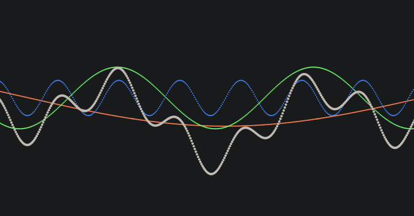
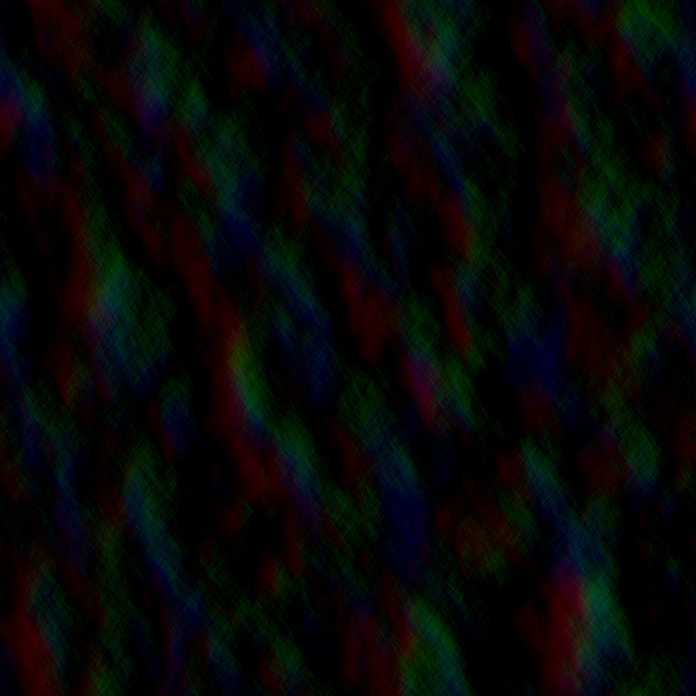

# A Real-Time Ocean Simulation Using Inverse FFT

Simulating the ocean accurately can prove a fairly difficult task, especially when considering performance. Traditionally, we can model the ocean in real-time using methods like summing of sine waves 

or Gerstner waves.

Instead of these, you can model the surface as a dynamic wave field generated from a Fourier-domain spectrum. This means the water can be basically as close to physically accurate as possible and still perfrom quite well due to the fast Fourier transforms.

To do this, we can represent waves statistically through a spectrum. This spectrum shows how wave energy is distributed across different frequencies and directions, meaning it can be used for motion. Instead of simulating each wave independently, you can create a broad wave field from the spectrum and transform it into spatial displacement data. You can effectively gather all the data using FFTs and multiple compute shaders. An example of the displacement data in an arbitrary frame:

To create the wave spectrum you can use wind speed, fetch, direction, depth, and gravity. Specifically, the JONSWAP spectrum is used, which is a method of constructing waves. [More Info on JONSWAP](https://www.wikiwaves.org/index.php/Ocean-Wave_Spectra#JONSWAP_Spectrum). Once the initial spectrum is created, it is evolved over time and passed through horizontal and vertical FFT stages. All these stages give us some heightmaps which are used to displace a mesh in the scene. The final stage assembles displacement and slope maps, which are used in the final render shaders.

A few techinal details should be mentioned that help this whole project work properly. The vast majority of the work is done on the GPU using compute shaders, allowing good enough performance for real time uses. There is also a lot of texture channel packing, like the example of the displacement texture.
